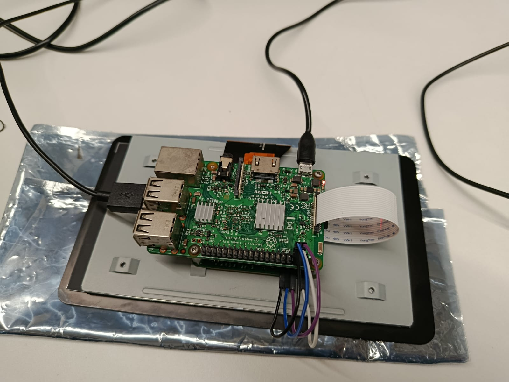
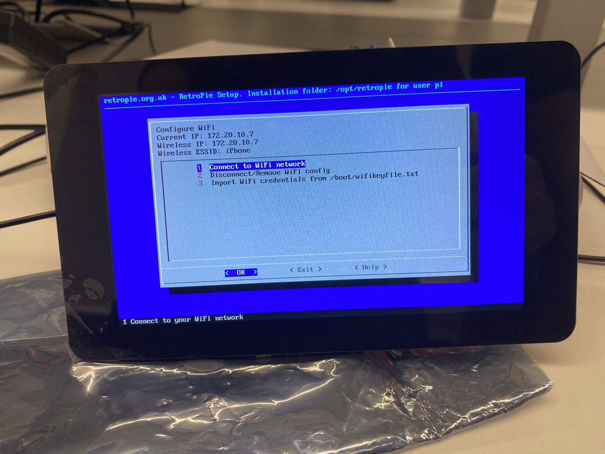

# 🎮 MauaGames - Emulador de Jogos Retrô com Raspberry Pi

MauaGames é um projeto de emulador de jogos retrô desenvolvido para a disciplina de Microcontroladores e Sistemas Embarcados no Instituto Mauá de Tecnologia. O sistema utiliza um Raspberry Pi e o software [RetroPie](https://retropie.org.uk/) para emular plataformas de jogos clássicas.

## 🛠️ Componentes Utilizados

* Raspberry Pi 3b
* Raspberry Pi touch display
* Teclado (para configuração)

  
*Figura 1 — Raspberry Pi 3b conectado ao display touch.*

## 🎯 Requisitos do Projeto

O objetivo do projeto era criar um console que atendesse aos seguintes requisitos:

* Capacidade de emular jogos de plataformas antigas, como Nintendo 64 e Atari.
* Gerenciamento de arquivos de save (progresso dos jogos) sincronizados na nuvem, utilizando Google Drive e Rclone.
* Suporte a qualquer tipo de controle, incluindo controles customizados conectados aos pinos GPIO (via Gpionext).
* Adaptação da resolução da tela para cada tipo de jogo.
* Conexão com a rede externa.
* Funcionalidade de mapeamento de botões.

## ⚙️ Processo de Configuração Geral

1.  O sistema operacional RetroPie foi baixado e instalado, e o display foi conectado ao Raspberry Pi.
2.  Foi configurado um perfil de usuário "MAUAGAMES", assim como o acesso à rede e o mapeamento padrão do teclado.
3.  O SSH foi habilitado para permitir a instalação de componentes e a configuração remota a partir de outro dispositivo.
4.  As ROMs (jogos) foram transferidas do computador local para a pasta de jogos do RetroPie via SSH.
    * ```bash
        scp -r C:\retropie\roms\* MAUAGAMES@172.20.10.7:~/RetroPie/roms/
        ```
  
*Figura 2 — Tela de configuração de rede do RetroPie.*
       
5.  Foi dada prioridade a jogos de Nintendo 64, pois apresentaram melhor desempenho.

## 🚀 Funcionalidades Principais Implementadas

Duas funcionalidades centrais foram implementadas para atender aos requisitos: Gpionext para controles customizados e Rclone para salvamento na nuvem.

### 1. Suporte a Controles GPIO (Gpionext)

O Gpionext é uma ferramenta que permite mapear botões físicos conectados diretamente aos pinos GPIO do Raspberry Pi, fazendo com que o sistema operacional os reconheça como um controle USB virtual. Esta funcionalidade é essencial para quem monta arcades ou consoles retrô personalizados.

* **Instalação:** O Gpionext foi clonado do repositório Git e instalado via script (`sudo ./install.sh`). Durante a instalação, foi configurado para iniciar automaticamente no boot do sistema.
* **Configuração:** Através do comando `sudo gpionext config`, um menu permite associar cada pino GPIO a um botão de controle específico (ex: "A", "B", "Start").
* **Detecção:** Após salvar a configuração, o Gpionext cria um dispositivo virtual que o EmulationStation (a interface do RetroPie) detecta automaticamente.

* ⚠️**Observação:** Durante os testes deste projeto, apesar da configuração de software estar correta, não foi possível ler os inputs do controle. A suspeita é de um defeito de hardware, possivelmente nos pinos GPIO do Raspberry Pi utilizado.

### 2. Sincronização de Saves na Nuvem (Rclone)

Um requisito complexo e implementado com sucesso foi a sincronização automática e bidirecional dos saves de jogos com o Google Drive. Isso permite que o progresso do jogador seja mantido na nuvem.

#### O Desafio: Emuladores Não-Padrão

A principal dificuldade foi que alguns emuladores autônomos, como o Mupen64Plus (utilizado para Nintendo 64), não respeitam as configurações de pastas padrão do RetroArch e salvam os arquivos em locais separados. A solução implementada aborda e resolve esse problema.

#### Solução Implementada

O processo foi dividido em três etapas cruciais:

**1. Configuração do Rclone**
O Rclone foi instalado (`sudo apt install rclone`) e configurado interativamente via SSH com o comando `rclone config`. Foi criado um novo "remote" (tipo 'n') chamado `gdrive`, conectado ao Google Drive (opção 18 no menu) após a autenticação via token em um navegador.
**Segurança de transporte:** O Rclone comunica-se com o Google Drive usando HTTPS/TLS por padrão (autenticação via OAuth2), garantindo que os arquivos de save sejam transferidos de forma criptografada.

**2. Centralização dos Diretórios de Saves**
Para garantir que todos os emuladores lessem e escrevessem na mesma pasta, todos os saves foram centralizados em `/home/pi/RetroPie/saves`.

* A pasta foi criada (`mkdir -p`) e saves antigos (arquivos `.srm` e `.state`) foram movidos das pastas de ROMs para o novo local centralizado.
* **Para Emuladores RetroArch (Padrão):** O arquivo global `/opt/retropie/configs/all/retroarch.cfg` foi editado (via menu do RetroArch ou manualmente) para que as diretivas `savefile_directory` e `savestate_directory` apontassem para `/home/pi/RetroPie/saves`.
* **Para Nintendo 64 (Mupen64Plus):** A correção crucial foi editar o arquivo `/opt/retropie/configs/n64/mupen64plus.cfg`. As diretivas `SaveStatePath` e `SaveSRAMPath` foram alteradas para `/home/pi/RetroPie/saves`.

**3. Automação com Scripts (Runcommand)**
Para automatizar a sincronização, foram utilizados os scripts `runcommand` do RetroPie, que executam ações ao iniciar e sair de um jogo.

* **Script de Início (`runcommand-onstart.sh`):**
    * **Objetivo:** Baixar os saves da nuvem para o Pi antes de o jogo começar.
    * **Comando:** `/usr/bin/rclone sync "gdrive:RetroPie/Saves" "/home/pi/RetroPie/saves"`.

* **Script de Saída (`runcommand-onend.sh`):**
    * **Objetivo:** Enviar os saves (novos ou atualizados) do Pi para a nuvem após o jogador sair do jogo.
    * **Comando:** `/usr/bin/rclone sync "/home/pi/RetroPie/saves" "gdrive:RetroPie/Saves"`.

Os scripts receberam permissão de execução (`chmod +x`) e o sistema foi reiniciado para aplicar as mudanças.

#### Verificação

O sistema foi validado com sucesso: ao iniciar um jogo (ex: Mario 64), jogar para criar um novo save e sair, o arquivo de save correspondente apareceu no Google Drive com o timestamp atualizado, confirmando que a sincronização automática estava funcionando.

## 🧩 Diagrama de Blocos

```mermaid
flowchart TB
  subgraph Cloud["Internet / Google Drive"]
    GD[Google Drive API]
  end

  subgraph Pi["Raspberry Pi 3b"]
    ES["RetroPie / EmulationStation\n(Emuladores)"]
    GP["GPIONext (GPIO -> virtual USB)"]
    SD["Diretório de saves\n(/home/pi/RetroPie/saves)"]
    SC["Scripts\n(runcommand-onstart / runcommand-onend)"]
  end

  Controls["Controles\n(USB / GPIO)"]

  GD -->|HTTPS (rclone sync)| SC
  Controls -->|USB / virtual USB| ES
  Controls -->|GPIO| GP
  GP -->|dispositivo virtual| ES
  ES -->|lê / grava saves| SD
  SC -->|sync bidirecional| SD
  SC -->|usa rclone| GD
```
